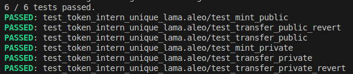
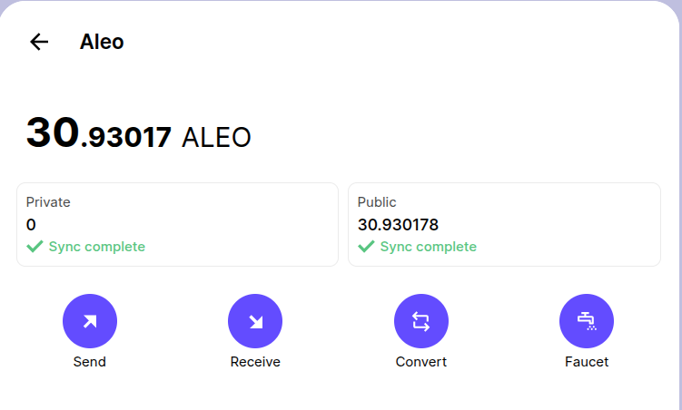
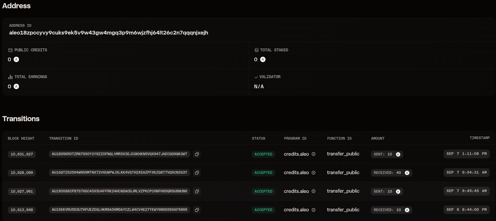
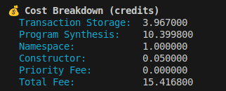
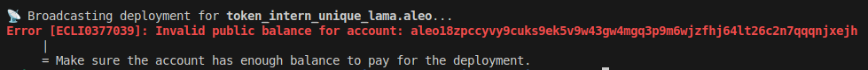

# Steps taken for Token Deployment

#### 1. Setting Up Local Environment

Vs Code was use as Code Editor. Local environment was setup using the [Offical Installation Guide](https://developer.aleo.org/guides/introduction/installation). Rust, Leo and SnarkOs was installed. A Gitup repo was setup and connected to complete the local environment Setup.

#### 2. Initializing the Project

` leo new  token_intern_unique_lama` was used to initalize a empty project.

#### 3. Updating Code and Fixing Bugs

In `main.leo` , the provided code was checked for bugs. The bugs were fixed and a new `transfer_public` function was implemented.

#### 4. Tests

A `test_token_intern_unique_lama.aleo` file was created where unit tests were carried out. The tests and their testing scenarios :

1. **_test_mint_private_**
   Checks whether the privately minted tokens are correctly minted or not. Checks both the address and amount minted.
2. **_test_transfer_private_revert_**
   Checks if the transition reverts or not if sender doesnt have enough funds.
3. **_test_transfer_private_**
   Checks the functionality of private transfer transition. Matches the senders and receivers balance before and after the transfer has been completed.
4. **_test_mint_public_**
   Checks whether the publicly minted tokens are correctly minted or not.
5. **_test_transfer_public_revert_**
   Checks if the transaction reverts or not if the sender doesnt have enough funds.
6. **_test_transfer_public_**
   Checks the functionality of public transfer transiiton and finalize functions.

##### All Tests were sucessful

#### 5. Deploy

For Deployment, `leo deploy --print --broadcast` was used. The values like NETWORK, PRIVATE_KEY and ENDPOINT were set in .env file. A bug where the public balances were not being updated in the explorer but were synced from the wallets effected the deployment of this program to the Aleo Testnet.

##### Some Screenshots:

###### 1. Public Balance in the wallet(Leo Wallet)

###### 2. Public Balance in the Provable explorer

###### 3. Credit Cost Breakdown

###### 4. Deployment/Broadcasting Error

# Questions Regarding Zero Knowledge Proofs.

## 1. What is a zero-knowledge proof (ZKP)?

Zero Knowledge proofs are cryptographic methdod which can be used by one party(Prover) to prove to another party(Verifier) that it contains knowledge about a certain piece of data without revealing the knowledge itself.
As blockchains are inherently transparent, maintaining the privacy of the users is difficult. Zero Knowledge Proofs help users to have some sort of privacy.

## 2. What are the three main properties of ZKPs?

The Three Main Properties/requirements of Zero Knowledge Proofs(ZKPs) are:

#### i. Completeness

If the statement is true, an honest prover must be able to convince the verifier.
For Example: Say a prover(Alice) knows the secret password of a lock then a Zero Knowledge protocol should always generate true proof and verifier(say Bob) should always be satisfied.

#### ii. Soundness

If the statement is false, no dishonest prover can convince an honest verifier.
For Example: Say a prover(Alice) doesnt know the secret password of a lock then a Zero Knowledge protocol should never be able to generate true proof and verifier(Bob) should never be satisfied.

#### iii. Zero-Knowledge

The verifier must learn nothing except that the prover's statement is true.
For Example: Say a prover(Alice) knows the secret password of a lock then a Zero Knowledge protocol should generate true proof and without disclosing the secret password to the verifier(Bob).

## 3. How does Aleo use ZKPs in its blockchain design?

Aleo is a privacy focused blockchain. It uses Leo Programming Language which converts the code to opcodes which are then used to form R1CS. These R1CS are then used to form Proof. Some ways in which Aleo uses ZKPs are:

- Public and Private balances can be maintained which ensures privacy for the users. The blockchain has no idea about the private balances. Only the user can access and use the private balances.

- Aleo uses tranisiton and finalize functions to complete a public transaction.
  Transition is used for off-chain computation purposes. Records are generated and tited to the users. In finalize function, these records are then updated to blockchain by updating public mappings.

- Computation doesnt happen onchain, only proofs are verified onchain.

For privacy Preserving Blockchains, Zero Knowledge Proofs provides a way to verify computations and statements without revelaing the underlying data. They help these chains to implement privacy preserving contracts which overcomes the inherent transparncy of blockchains.

## 4. Compare ZKPs with traditional cryptographic proofs.

- ZKPs enable two parties to reach consensus without revelaing the data whereas traditional cryptographic proofs reveal the data.
- ZKPs are more computationally intensive than traditional cryptographic proofs.
- ZKPs help in scalability in some cases which is not possible by traditional cryptogrpahic proofs.
- Privacy from ZKPs ensures no information leak. This is not garanteed in traditional cryptographic proofs.
- ZKPs are mathematically complex and harder to implement than traditional cryptographic proofs.
